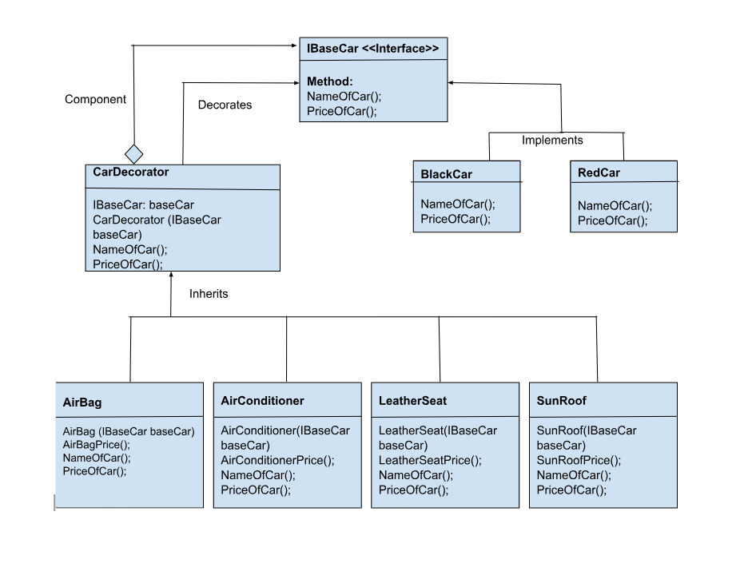

# Overview

Software design patterns are programming paradigms that describe reusable patterns for common design problems. They are a set of tried and tested solutions to common problems in software design. They are not algorithms or code snippets that can be copied and pasted into your code. They are more like templates that can be applied to different situations. They are not a substitute for good software design principles, but they are a good starting point for designing your software. They are a good way to document your design decisions. They are a good way to communicate your design to other developers.

Decorator Design Pattern is demonstrated in this project. It allow us to add dynamically add new functionalities to an existing object without altering and modifying its structure and this design pattern acts as a wrapper to the existing class. In short, A decorator is an object that adds features to another object.

A real life example of a decorator design pattern would be a car, car base here would be the original class, and the variety of different colors of the car, with different functionalities like SunRoof, LeatherSeat, AirBag, etc. would act as the added functionalities. The customer can buy car with different functionalities as per their choice and the base car (original class) would remain intact.

# Design

This project defines a base car Interface with methods as NameOfCar() and PriceOfCar() . Then blackCar and redCar implements the interface with its methods. Then I defines the CarDecorator class which will add additional functionalities to the base car and after adding it will again will be a object which can be further decorate. So all the additional functionalities inherits the decorator class.

# Environment

The project builds and runs with Visual Studio Community 2022.
